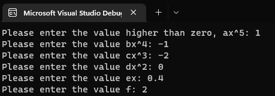
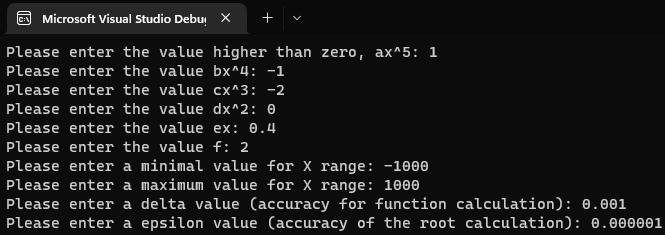
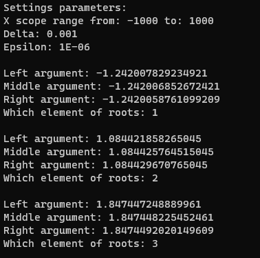
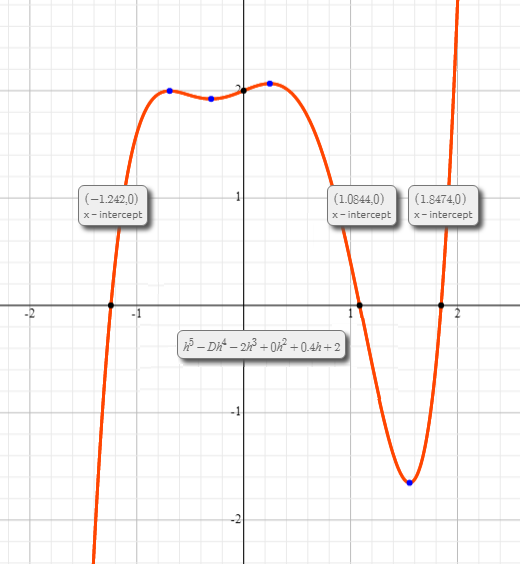

# Sprawozdanie z prezentacji algorytmu rozwiązywania równania 5 stopnia, metodą bisekcji

## Projekt numer 2 - Algorytmy i struktury danych

### `Autor: Krystian Petek`

Metoda bisekcji zwana również metodą połowienia lub wyszukiwaniem binarnym pozwala stosunkowo szybko znaleźć pierwiastek dowolnej funkcji w zadanym przedziale poszukiwań [a,b]. Aby można było zastosować metodę bisekcji, funkcja musi spełniać kilka warunków początkowych:

- Funkcja musi być określona w przedziale
- Funkcja musi być ciągła w przedziale
- Na krańcach przedziału [a,b] funkcja musi mieć różne znaki

### **1. Użytkownik jest proszony o podanie parametrów równania stopnia piątego**

Użytkownik podaje parametry o wartościach:

- `a`x^5 = `1`
- `b`x^4 = `-1`
- `c`x^3 = `-2`
- `d`x^2 = `0`
- `e`x = `0.4`
- `f` = `2`

### **2. Następnie użytkownik jest proszony o podanie parametrów konfiguracyjnych**

Parametry konfiguracyjne to:

- Początek przedziału poszukiwań pierwiastka, minimalna wartość osi X
- Koniec przedziału poszukiwań pierwiastka, maksymalna wartość osi X
- Delta, dokładność obliczania funkcji
- Epsilon, dokładność obliczania pierwiastka

Użytkownik podaje parametry o wartościach:

- minimalna wartość osi X: `-1000`
- maksymalna wartość osi X: `1000`
- delta = `0.001`
- epsilon = `0.000001`

### **3. Po wpisaniu wszystkich wymaganych parametrów, wyświetla się wynik działania programu.**

Rezultat działania programu dla zadanych parametrów funkcji oraz wymaganej konfiguracji.

Wynikiem działania programu jest rezultat - miejsca zerowe w punktach:

- x1: `-1.242`
- x2: `1.0844`
- x3: `1.8474`

W celu weryfikacji poprawności wyniku zamieszczam zrzut ekranu grafu do zgodny z parametrami równania [(źródło)](https://www.symbolab.com/graphing-calculator/polynomial-function)

### **4. Użytkownik wcisnął dowolny klawisz. Program kończy działanie.**
