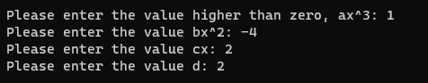

# Sprawozdanie z prezentacji algorytmu rozwiązywania równania sześciennego

## Projekt numer 2 - Algorytmy i struktury danych

### `Autor: Krystian Petek`

Równanie sześcienne lub trzeciego stopnia – równanie algebraiczne postaci  gdzie a != 0. Każde równanie sześcienne o współczynnikach rzeczywistych ma przynajmniej jeden pierwiastek rzeczywisty.

### **1. Użytkownik jest proszony o podanie parametrów równania stopnia trzeciego**

Użytkownik podaje parametry o wartościach:

- `a`x^3 = 1
- `b`x^2 = -4
- `c`x = 2
- `d` = 2

### **2. Po zatwierdzeniu wszystkich parametrów pojawi się wynik działania algorytmu**

W celu weryfikacji poprawności wyniku zamieszczam zrzut ekranu wykresu do zgodny z parametrami równania [(źródło)](https://www.symbolab.com/graphing-calculator/polynomial-function)

### **3. Użytkownik wcisnął dowolny klawisz. Program kończy działanie.**

### **4. Przykład numer 2, opis oraz wynik działania programu**

Poniższe zrzuty ekranu przedstawiają wynik działania programu dla równania o parametrach w których wartość delty jest dodatnia.

Użytkownik podaje parametry o wartościach:

- `a`x^3 = 1
- `b`x^2 = -2
- `c`x = -4
- `d` = -4

Wynikiem działania programu jest rezultat - `1 pierwiastek rzeczywisty i 2 zespolone`

### **5. Użytkownik wcisnął dowolny klawisz. Program kończy działanie.**
