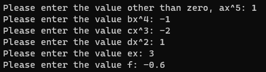
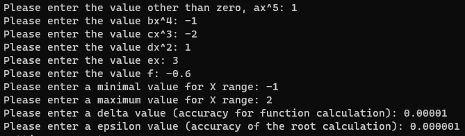
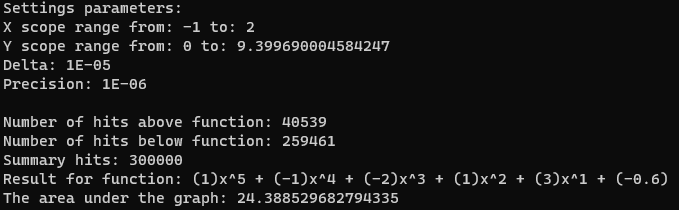
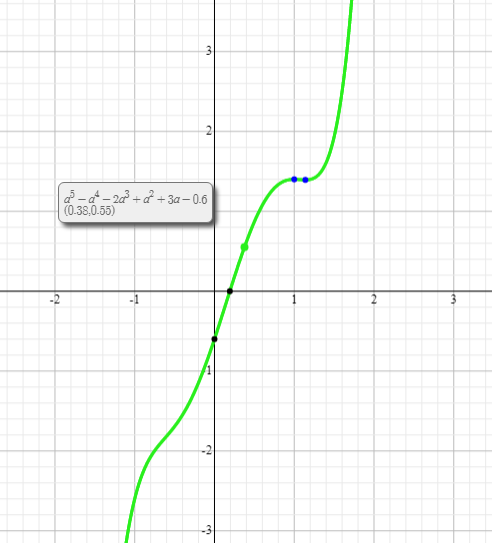
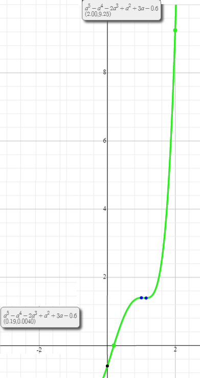

# Sprawozdanie z prezentacji algorytmu całkowania numerycznego, metodą Monte Carlo

## Projekt numer 4 - Algorytmy i struktury danych

### `Autor: Krystian Petek`

Metoda Monte Carlo – metoda stosowana do modelowania matematycznego procesów zbyt złożonych (obliczania całek, łańcuchów procesów statystycznych), aby można było przewidzieć ich wyniki za pomocą podejścia analitycznego. Istotną rolę w tej metodzie odgrywa losowanie (wybór przypadkowy) wielkości charakteryzujących proces, przy czym losowanie dokonywane jest zgodnie z rozkładem, który musi być znany.

### **1. Użytkownik jest proszony o podanie parametrów wielomianu stopnia piątego**

Użytkownik podaje parametry o wartościach:

- `a`x^5 = `1`
- `b`x^4 = `-1`
- `c`x^3 = `-2`
- `d`x^2 = `1`
- `e`x = `3`
- `f` = `-0.6`

### **2. Następnie użytkownik jest proszony o podanie parametrów konfiguracyjnych**

Parametry konfiguracyjne to:

- Początek przedziału poszukiwań pierwiastka, minimalna wartość osi X
- Koniec przedziału poszukiwań pierwiastka, maksymalna wartość osi X
- Delta, dokładność obliczania funkcji
- Epsilon, dokładność obliczania pierwiastka

Użytkownik podaje parametry o wartościach:

- minimalna wartość osi X: `-1`
- maksymalna wartość osi X: `2`
- delta = `0.00001`
- epsilon = `0.000001`

### **3. Po wpisaniu wszystkich wymaganych parametrów, wyświetla się wynik działania programu.**

Rezultat działania programu dla zadanych parametrów funkcji oraz wymaganej konfiguracji.

Wynikiem działania programu jest rezultat:

- Parametry konfiguracyjne wprowadzone przez użytkownika
- Wyliczony przez algorytm zakres osi Y, zakres obliczanej całki
- Ilość wylosowanych liczb pod wykresem oraz ilość wylosowanych liczb nad wykresem
- Suma losowań
- Obliczona wartość pola powierzchni pod wykresem całki dla wprowadzonych parametrów

W celu weryfikacji poprawności wyniku zamieszczam zrzut ekranu wykresu do zgodny z parametrami równania [(źródło)](https://www.symbolab.com/graphing-calculator/polynomial-function)

Podgląd wykresu:

Weryfikacja poprawności

### **4. Użytkownik wcisnął dowolny klawisz. Program kończy działanie.**
