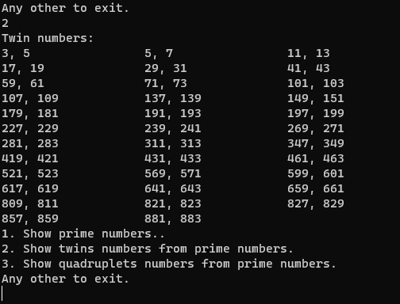

# Sprawozdanie z prezentacji algorytmu Sita Eratostenesa

## Projekt numer 1 - Algorytmy i struktury danych

### `Autor: Krystian Petek`

Sito Eratostenesa jest to algorytm wyznaczania liczb pierwszych ze zbioru liczb naturalnych z zadanego przedziału od [2 do N]

### **1. Użytkownik podaje liczbę N - koniec przedziału wyznaczania liczb pierwszych. W prezentowanym przykładzie podano N = 1000**

### **2. Pojawia się menu wyboru jednej z 3 opcji**

- Show prime numbers
- Show twins numbers from prime numbers.
- Show quadruplets numbers from prime numbers.

### **3. Użytkownik wybrał opcje numer 1.**

Na konsoli wyświetla się lista z liczbami pierwszymi z podanego zakresu od 2 do 1000

### **4. Pojawia się ponownie menu wyboru jednej z 3 opcji.**

Użytkownik wybrał opcję numer 2. Wyświetla się lista 'bliźniaków' liczb pierwszych

### **5. Pojawia się kolejny raz menu wyboru, tym razem użytkownik wybrał opcję numer 3.**

### **6. Użytkownik wybrał liczbę 0. Program kończy działanie.**
