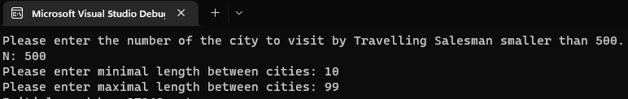
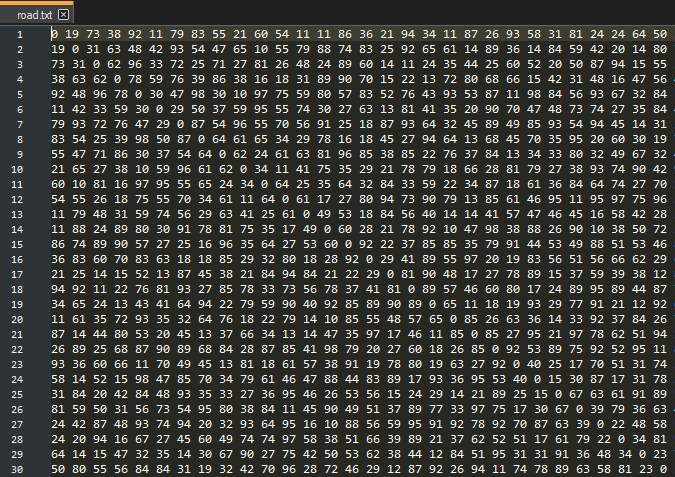
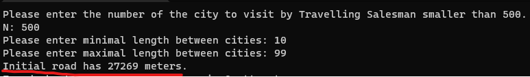
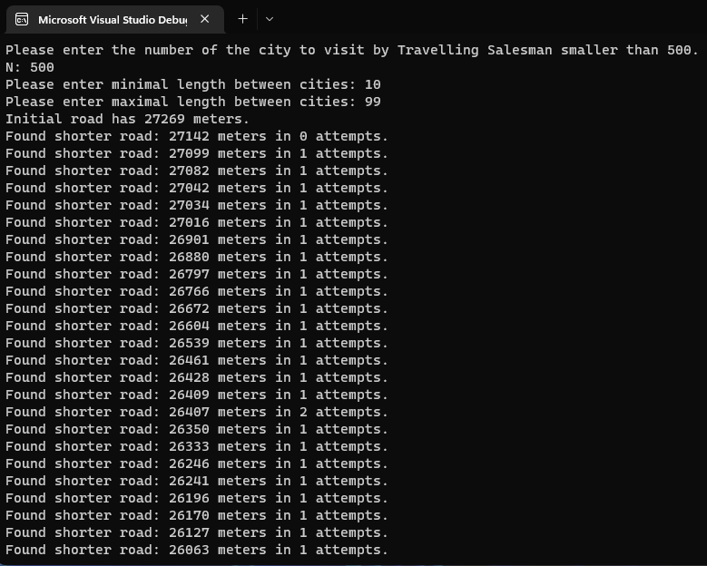
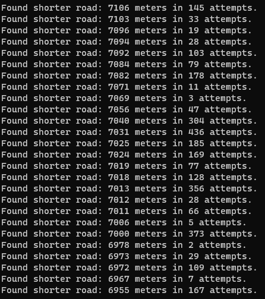
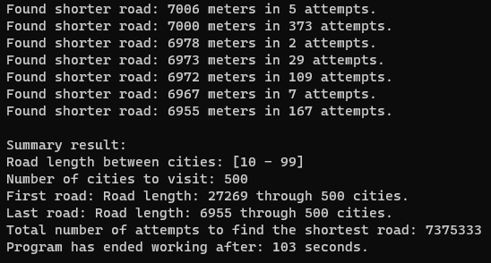

# Sprawozdanie z prezentacji algorytmu wyznaczania najkrótszej ścieżki, problem komiwojażera

## Projekt numer 5 - Algorytmy i struktury danych

### `Autor: Krystian Petek`

Problem komiwojażera - problem obliczeniowy polegający na poszukiwaniu w grafie takiego cyklu, który zawiera wszystkie wierzchołki (każdy dokładnie raz) i ma jak najmniejszy koszt.

Bardziej formalnie, problem komiwojażera polega na poszukiwaniu w grafie cyklu Hammiltona o najmniejszej wadze.

Problem ma liczne zastosowania w życiu codziennym. Najlepszym przykładem jest praca kuriera, który musi wyjechać z magazynu, zawieźć przesyłki w różne miejsca i wrócić do magazynu.

### **1. Użytkownik jest proszony o podanie parametrów**

Użytkownik podaje parametry:

- N - ilość miast do odwiedzenia (długość sciezki): `500`
- Minimalną odległość pomiędzy miastami: `10`
- Maksymalną odległość pomiędzy miastami: `99`

### **2. Następnie program rozpoczyna działanie**

1. Pierwszym krokiem podczas działania programu jest sprawdzanie czy w katalogu wyjściowym tj.
   `.\bin\Debug\net7.0` istnieje plik `config.json` który zawiera ostatnią konfiguracje wprowadzoną przez użytkownika.

   - Jeśli istnieje to kolejnym krokiem jest sprawdzenie czy ostatnia konfiguracja różni się od wartości wprowadzonych przez użytkownika podczas aktualnego działania programu rozpoczyna się kolejny etap.

   - W przypadku braku pliku plik konfiguracyjny jest tworzony i ostatnia konfiguracja jest zapisywana do pliku.

2. Kolejnym zadaniem które jest wylosowanie odległości pomiędzy miastami w formie macierzy [N x N] w której wartości opisują dystans pomiędzy każdym z miast.

   - Wynikowa macierzy zapisywana jest w pliku `road.txt` w tym samym folderze co plik konfiguracyjny

   > `Wycinek 30 pierwszych wartości w macierzy:` 

3. Następnie wyznaczana jest ścieżka pomiędzy miastami przez liczby kolejno od 1 do N

4. Dla wyznaczonej scieżki między miastami losowana jest odległość z miasta do miasta

### **3. Dla inicjalnej drogi wyznaczonej w kroku poprzednim zostaje obliczona długość drogi od miasta 1 do N.**

Wyznaczona długość dla drogi poprzez miasta od 1 kolejno do N wynosi 27269 metrów.

### **4. Następnie rozpoczyna się proces poszukiwania najkrótszej długości drogi dla problemu komiwojażera**

Podczas gdy znaleziono krótszą drogę przez wszystkie miasta, wynik zostaje wypisany do konsoli oraz dostajemy informacje ile kroków poczynił program aby znaleźć drogę bardziej optymalną od poprzedniej.

-
-
-

### **5. Wyjaśnienie dziania algorytmu poszukującego najkrótszej ściezki**

Podczas poszukiwania najkrótszej ścieżki sprawdzana była ilość prób od momentu poprzednio znalezionej krótszej ściezki.

Jeśli wartość się nie zmieniła od po wykonaniu `10000` próbnych losowań kolejnej ścieżki, program kończy swoje działanie.

Logi z działania programu zostały zapisane w pliku tekstowym, który jest przechowywany do momentu uruchomienia go ponownie. Znajduje się on również w ścieżce gdzie jest zapisana macierz [N x N] oraz plik konfiguracyjny lecz w pliku `log.log`.

### **6. Ostatnim już krokiem jest wyświetlenie rezultatu działania programu**

Rezultat wyświetlany na konsoli zawiera informacje:

- Wartość minimalna i maksymalna pomiędzy miastami wprowadzona przez użytkownika podczas startu programu
- Liczba miast do zwiedzenia przez komiwojażera
- Długość pierwszej wyznaczonej trasy
- Długość ostatniej wyznaczonej trasy (prawdopodobnie najkrótsza, lecz nie mamy 100% pewności)

Informacje o trasach najkrótszej i najdłuższej można znaleźć w pliku `output.txt` wraz z innymi plikami wynikowymi.

- Łączna liczba wykonanych prób odnalezienia najkrótszej trasy
- Czas działania programu, czas poszukiwania najoptymalniejszej ścieżki

### **7. Użytkownik wcisnął dowolny klawisz. Program kończy działanie.**
